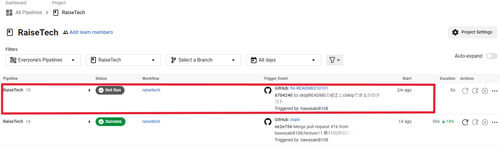
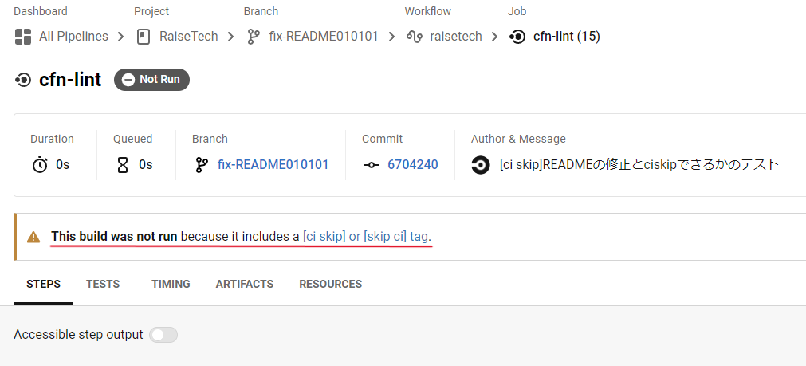
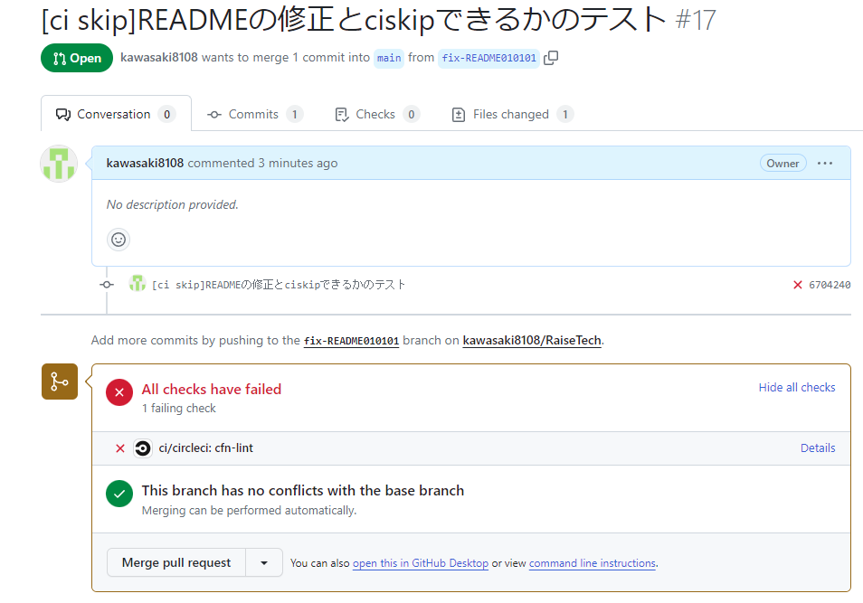
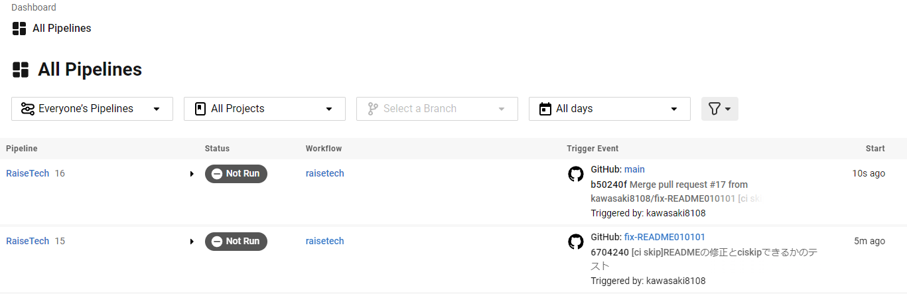

# CircleCI
## ジョブとワークフローのスキップとキャンセル方法のメモ
### 背景
* CircleCIのconfig.ymlファイルを組み込んだリポジトリで、CircleCIを走らせたいわけではないときがあります
* ただpushやmergeしたタイミングでCircleCIが稼働し、パイプラインを走らせてしまいます
調べると`[ci skip]`という文字列をcommitメッセージ内に埋め込むと停止するらしいのでやってみました。

### 方法
以下の通り、commitのメッセージ内に`[ci skip]`をいれるだけです
```bash
git commit -m "[ci skip]hogehogehoge"
```

参考記事）
* （公式）[ジョブとワークフローのスキップとキャンセル](https://circleci.com/docs/ja/skip-build/)
  * >**ジョブをスキップする**
CircleCI はデフォルトでは、プロジェクトに変更をプッシュするたびに自動的にパイプラインをトリガーします。 この動作を無効にするには、コミットの本文またはタイトルの最初の 250 文字の中に、 [ci skip] タグまたは [skip ci] タグを追加します。 これにより、マークされたコミットだけでなく、そのプッシュに含まれる他のすべてのコミットもスキップされます。
* [CIサービスの自動ビルドをスキップする方法まとめ](https://qiita.com/vmmhypervisor/items/f10c77a375c2a663b300)
* [Gitのpush時にCIのビルドを回避する方法](https://techracho.bpsinc.jp/sugita/2019_12_18/84820)
  * ↑「コミットメッセージのテンプレートを作る」方法もあるようです
* [いまさらだけどCircleCIに入門したので分かりやすくまとめてみた](https://qiita.com/gold-kou/items/4c7e62434af455e977c2)

### 結果
#### ▼pushしたとき
ローカルrepoからリモートrepoにpushした直後<br>
<br>
↓公式の記述どおり、`[ci skip]`か`[skip ci]`の記述があればいいようですね<br>
<br>
#### ▼Pull Requestしたとき
意図した「failed」なので問題ないと思います<br>
<br>
#### ▼mergeしたとき
<br>

以上です。意図したとおりにCircleCIの稼働がスキップされました。